	

	
	
	
	

## What it does

TunnelVision is a Fabric mod for Minecraft 26.1.2 that adds mining features to Hypixel SkyBlock, with a focus on Glacite Mineshafts. With TunnelVision you get:

- **Mineshaft Info:** See the mineshaft type, its corpses and whether the gemstones are worth mining as soon as you enter.
- **Waypoints:** Find every corpse spot and the fossil.
- **Timers & Reminders:** Pickaxe ability, mining effects, lanterns, the Forge and crystals waiting to be forged.
- **Party Tools:** Share your mineshaft, warp into a shared one with one key press and let your party use `!pt` and `!warp`.
- **Mining Stats:** Sky Mall, Mineshaft Mayhem, mining events and Cold Resistance at a glance.
- **And more:** Wrong gear warnings, a Blue Cheese corpse lock, a Cut Loose tracker and less chat spam.

## Getting Started

- **Install:** Put the jar from the [latest release](https://github.com/TunnelVisionMod/TunnelVision/releases/latest) in your `mods` folder together with [Fabric API](https://modrinth.com/mod/fabric-api), [Fabric Language Kotlin](https://modrinth.com/mod/fabric-language-kotlin) and the [Hypixel Mod API](https://modrinth.com/mod/hypixel-mod-api).
- **Set Up:** Type `/tv` or `/tunnelvision` in-game. Every feature is off by default, so turn on what you need.
- **Move HUDs:** Type `/tv hud` to move the HUD widgets.

## Support

Found a bug or have an idea? Open an [issue](https://github.com/TunnelVisionMod/TunnelVision/issues).

## Contributing

Want to add a feature or fix a bug yourself? Check out the [contributing guide](CONTRIBUTING.md).

## Authors

Made by [@ISingularity0](https://github.com/ISingularity0) and [@ImNeppy](https://github.com/ImNeppy).

TunnelVision is not affiliated with Hypixel or Mojang. Licensed under [MIT](LICENSE).
